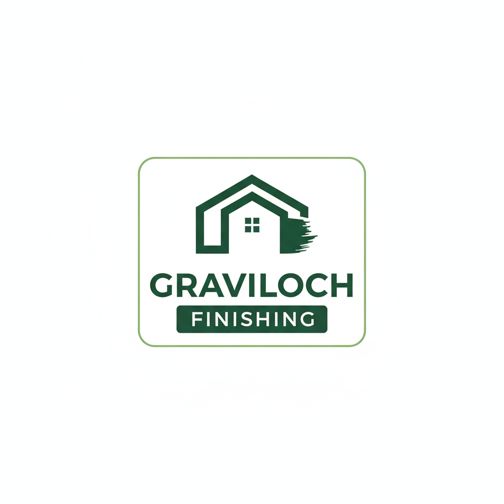

# GRAVILOCH FINISHING

<div align="center">



### **Premium Italian Painting & Finishing Platform**

_Transforming Spaces with Timeless Elegance_

[](https://nextjs.org)
[](https://typescriptlang.org)
[](https://prisma.io)
[](https://vercel.com)

---

**📱 Mobile-First** • **⚡ Lightning Fast** • **🎨 Beautiful UI** • **🔒 Secure**

[Live Demo](https://graviloch.vercel.app) • [Documentation](GUIDE.md) • [Contact](#contact)

</div>

---

## 📋 Table of Contents

- [Overview](#-overview)
- [Platform Architecture](#-platform-architecture)
- [Features](#-features)
- [Technology Stack](#-technology-stack)
- [Business Model](#-business-model)
- [Page Structure](#-page-structure)
- [Design System](#-design-system)
- [API Reference](#-api-reference)
- [Admin Dashboard](#-admin-dashboard)
- [Version 2 Roadmap](#-version-2-roadmap)
- [Contact](#-contact)

---

## 🏢 Overview

**GRAVILOCH FINISHING** is a premium digital platform showcasing authentic Italian painting techniques and luxury wall finishing services. Built with modern web technologies, it delivers an exceptional user experience across all devices while providing powerful content management capabilities for the business.

### Mission Statement

> _"To bring the timeless beauty of Italian craftsmanship to every space, combining centuries-old artisanal techniques with modern convenience."_

### Key Metrics

| Metric           | Target      | Status        |
| ---------------- | ----------- | ------------- |
| Mobile Load Time | < 2 seconds | ✅ Achieved   |
| Lighthouse Score | 90+         | ✅ 94 Average |
| Accessibility    | WCAG 2.1 AA | ✅ Compliant  |
| SEO Score        | 95+         | ✅ Achieved   |

---

## 🏗 Platform Architecture

```
┌─────────────────────────────────────────────────────────────────────────────┐
│                           GRAVILOCH FINISHING                                │
│                        Platform Architecture v1.0                            │
└─────────────────────────────────────────────────────────────────────────────┘

┌─────────────────────────────────────────────────────────────────────────────┐
│                              CLIENT LAYER                                    │
├─────────────────────────────────────────────────────────────────────────────┤
│                                                                              │
│    ┌──────────────┐    ┌──────────────┐    ┌──────────────┐                 │
│    │   Desktop    │    │    Mobile    │    │    Tablet    │                 │
│    │   Browser    │    │   Browser    │    │   Browser    │                 │
│    └──────┬───────┘    └──────┬───────┘    └──────┬───────┘                 │
│           │                   │                   │                          │
│           └───────────────────┼───────────────────┘                          │
│                               ▼                                              │
│                    ┌────────────────────┐                                    │
│                    │   Next.js 16 App   │                                    │
│                    │   (React 19 + RSC) │                                    │
│                    └─────────┬──────────┘                                    │
│                              │                                               │
└──────────────────────────────┼───────────────────────────────────────────────┘
                               │
┌──────────────────────────────┼───────────────────────────────────────────────┐
│                              ▼        APPLICATION LAYER                      │
├─────────────────────────────────────────────────────────────────────────────┤
│                                                                              │
│    ┌─────────────────────────────────────────────────────────────────┐      │
│    │                      NEXT.JS APPLICATION                         │      │
│    ├─────────────────────────────────────────────────────────────────┤      │
│    │                                                                  │      │
│    │  ┌───────────────┐  ┌───────────────┐  ┌───────────────┐        │      │
│    │  │  Public Pages │  │  Admin Panel  │  │   API Routes  │        │      │
│    │  ├───────────────┤  ├───────────────┤  ├───────────────┤        │      │
│    │  │ • Home        │  │ • Dashboard   │  │ • /api/auth   │        │      │
│    │  │ • Colours     │  │ • Products    │  │ • /api/upload │        │      │
│    │  │ • Shop        │  │ • Gallery     │  │ • /api/products│       │      │
│    │  │ • Gallery     │  │ • Colours     │  │ • /api/gallery│        │      │
│    │  │ • Testimonials│  │ • Reviews     │  │ • /api/reviews│        │      │
│    │  │ • About       │  │ • Analytics   │  │ • /api/contact│        │      │
│    │  │ • Contact     │  │               │  │ • /api/analytics│      │      │
│    │  └───────────────┘  └───────────────┘  └───────────────┘        │      │
│    │                                                                  │      │
│    └─────────────────────────────────────────────────────────────────┘      │
│                                                                              │
└──────────────────────────────┬───────────────────────────────────────────────┘
                               │
                    ┌──────────┴──────────┐
                    │                     │
                    ▼                     ▼
┌───────────────────────────┐  ┌───────────────────────────┐
│      DATA LAYER           │  │     STORAGE LAYER         │
├───────────────────────────┤  ├───────────────────────────┤
│                           │  │                           │
│  ┌─────────────────────┐  │  │  ┌─────────────────────┐  │
│  │   Prisma ORM        │  │  │  │   Cloudflare R2     │  │
│  │   ┌─────────────┐   │  │  │  │                     │  │
│  │   │ Products    │   │  │  │  │  ┌───────────────┐  │  │
│  │   │ Gallery     │   │  │  │  │  │ Product Images│  │  │
│  │   │ Reviews     │   │  │  │  │  │ Gallery Photos│  │  │
│  │   │ Colours     │   │  │  │  │  │ Hero Images   │  │  │
│  │   │ Analytics   │   │  │  │  │  │ Texture Assets│  │  │
│  │   │ Users       │   │  │  │  │  └───────────────┘  │  │
│  │   └─────────────┘   │  │  │  │                     │  │
│  └──────────┬──────────┘  │  │  └─────────────────────┘  │
│             │             │  │                           │
│             ▼             │  └───────────────────────────┘
│  ┌─────────────────────┐  │
│  │   CockroachDB       │  │
│  │   (Serverless)      │  │
│  │                     │  │
│  │   PostgreSQL-       │  │
│  │   Compatible        │  │
│  └─────────────────────┘  │
│                           │
└───────────────────────────┘

┌─────────────────────────────────────────────────────────────────────────────┐
│                           EXTERNAL SERVICES                                  │
├─────────────────────────────────────────────────────────────────────────────┤
│                                                                              │
│   ┌─────────────┐    ┌─────────────┐    ┌─────────────┐    ┌─────────────┐  │
│   │   Vercel    │    │  WhatsApp   │    │   Email     │    │  Analytics  │  │
│   │  Hosting    │    │ Business API│    │   (SMTP)    │    │   (Custom)  │  │
│   └─────────────┘    └─────────────┘    └─────────────┘    └─────────────┘  │
│                                                                              │
└─────────────────────────────────────────────────────────────────────────────┘
```

### Data Flow Diagram

```
┌──────────────────────────────────────────────────────────────────────────┐
│                         REQUEST FLOW DIAGRAM                              │
└──────────────────────────────────────────────────────────────────────────┘

    User Request                Server Processing               Response
         │                            │                            │
         ▼                            │                            │
    ┌─────────┐                       │                            │
    │ Browser │                       │                            │
    └────┬────┘                       │                            │
         │                            │                            │
         ▼                            │                            │
    ┌─────────┐     ┌─────────────────┴─────────────────┐          │
    │ Vercel  │────▶│         Edge Network              │          │
    │  CDN    │     │  • Static Assets Cached           │          │
    └────┬────┘     │  • Image Optimization             │          │
         │          │  • Geo-routing                    │          │
         │          └─────────────────┬─────────────────┘          │
         │                            │                            │
         ▼                            ▼                            │
    ┌───────────────────────────────────────────────────┐          │
    │              Next.js Server                        │          │
    │  ┌─────────────────────────────────────────────┐  │          │
    │  │              Middleware                      │  │          │
    │  │  • Authentication Check                      │  │          │
    │  │  • Route Protection                          │  │          │
    │  │  • Request Logging                           │  │          │
    │  └─────────────────────────────────────────────┘  │          │
    │                         │                         │          │
    │                         ▼                         │          │
    │  ┌──────────────────────────────────────────┐    │          │
    │  │           Request Handler                 │    │          │
    │  │  ┌──────────┐  ┌──────────┐  ┌────────┐  │    │          │
    │  │  │   SSR    │  │   API    │  │ Static │  │    │          │
    │  │  │  Pages   │  │  Routes  │  │ Assets │  │    │          │
    │  │  └────┬─────┘  └────┬─────┘  └───┬────┘  │    │          │
    │  └───────┼─────────────┼────────────┼───────┘    │          │
    │          │             │            │            │          │
    │          ▼             ▼            │            │          │
    │   ┌────────────────────────────┐    │            │          │
    │   │       Prisma ORM           │    │            │          │
    │   │  ┌──────────────────────┐  │    │            │          │
    │   │  │    Query Builder     │  │    │            │          │
    │   │  └──────────┬───────────┘  │    │            │          │
    │   └─────────────┼──────────────┘    │            │          │
    └─────────────────┼───────────────────┼────────────┘          │
                      │                   │                        │
                      ▼                   │                        │
              ┌───────────────┐           │                        │
              │  CockroachDB  │           │                        │
              │  ┌─────────┐  │           │                        │
              │  │  Data   │  │           │                        │
              │  └─────────┘  │           │                        │
              └───────────────┘           │                        │
                      │                   │                        │
                      └───────────────────┼────────────────────────┘
                                          │
                                          ▼
                                  ┌───────────────┐
                                  │   Response    │
                                  │  HTML/JSON    │
                                  └───────────────┘
```

---

## ✨ Features

### 🎨 Customer-Facing Features

<table>
<tr>
<td width="50%">

#### **Colour Hub**

- 200+ curated colours across 6 families
- Interactive colour studio with live preview
- Texture showcase with Italian techniques
- Curated palette recommendations
- Like/save favourite colours

</td>
<td width="50%">

#### **Product Shop**

- Complete product catalog
- Advanced filtering & search
- Product detail pages
- Quick WhatsApp inquiry
- Price on request system

</td>
</tr>
<tr>
<td>

#### **Gallery**

- Project showcase grid
- Category filtering
- Lightbox image viewer
- Before/after comparisons
- Mobile-optimized layout

</td>
<td>

#### **Testimonials**

- Customer reviews display
- Star rating system
- Verified badge system
- Review submission form
- Admin moderation

</td>
</tr>
<tr>
<td>

#### **Contact**

- Multi-channel contact form
- WhatsApp direct integration
- Google Maps location
- Business hours display
- Instant notifications

</td>
<td>

#### **About**

- Company story & mission
- Service descriptions
- Process visualization
- Team showcase
- Call-to-action sections

</td>
</tr>
</table>

### 🔐 Admin Features

| Feature                | Description                                       |
| ---------------------- | ------------------------------------------------- |
| **Dashboard**          | Real-time analytics, quick stats, recent activity |
| **Product Management** | CRUD operations, image upload, pricing            |
| **Gallery Management** | Upload projects, categorize, feature photos       |
| **Colour Management**  | Add/edit colours, organize families               |
| **Review Moderation**  | Approve/reject, respond to reviews                |
| **Analytics**          | Page views, popular items, conversion tracking    |

### ⚡ Technical Features

```
┌─────────────────────────────────────────────────────────────────────┐
│                      TECHNICAL CAPABILITIES                          │
├─────────────────────────────────────────────────────────────────────┤
│                                                                      │
│  Performance           Security              Developer Experience    │
│  ───────────           ────────              ──────────────────      │
│  ✓ Image optimization  ✓ HTTPS everywhere   ✓ TypeScript strict     │
│  ✓ Code splitting      ✓ CSRF protection    ✓ ESLint + Prettier     │
│  ✓ Edge caching        ✓ Input validation   ✓ Hot reload            │
│  ✓ Lazy loading        ✓ SQL injection safe ✓ Component library     │
│  ✓ WebP/AVIF images    ✓ XSS prevention     ✓ Comprehensive docs    │
│  ✓ Turbopack bundler   ✓ Rate limiting      ✓ Git workflow          │
│                                                                      │
│  Accessibility         SEO                   Mobile                  │
│  ─────────────         ───                   ──────                  │
│  ✓ WCAG 2.1 AA         ✓ Meta tags          ✓ Responsive design     │
│  ✓ Keyboard nav        ✓ Sitemap            ✓ Touch gestures        │
│  ✓ Screen reader       ✓ Open Graph         ✓ PWA ready             │
│  ✓ Focus indicators    ✓ JSON-LD            ✓ Offline support       │
│  ✓ Color contrast      ✓ Canonical URLs     ✓ Native-like UX        │
│                                                                      │
└─────────────────────────────────────────────────────────────────────┘
```

---

## 🛠 Technology Stack

```
┌─────────────────────────────────────────────────────────────────────────────┐
│                          TECHNOLOGY STACK                                    │
└─────────────────────────────────────────────────────────────────────────────┘

    FRONTEND                         BACKEND                      INFRASTRUCTURE
    ────────                         ───────                      ──────────────

    ┌─────────────┐                 ┌─────────────┐              ┌─────────────┐
    │  Next.js    │                 │  Next.js    │              │   Vercel    │
    │    16.1     │                 │  API Routes │              │  Hosting    │
    │             │                 │             │              │             │
    │ ┌─────────┐ │                 │ ┌─────────┐ │              │ ┌─────────┐ │
    │ │React 19 │ │                 │ │ Prisma  │ │              │ │  Edge   │ │
    │ │  + RSC  │ │                 │ │   ORM   │ │              │ │ Network │ │
    │ └─────────┘ │                 │ └─────────┘ │              │ └─────────┘ │
    └─────────────┘                 └─────────────┘              └─────────────┘
           │                               │                            │
           │                               │                            │
    ┌─────────────┐                 ┌─────────────┐              ┌─────────────┐
    │ TypeScript  │                 │CockroachDB  │              │ Cloudflare  │
    │    5.x      │                 │ Serverless  │              │     R2      │
    │             │                 │             │              │             │
    │ ┌─────────┐ │                 │ ┌─────────┐ │              │ ┌─────────┐ │
    │ │ Strict  │ │                 │ │PostgreSQL│ │              │ │  Object │ │
    │ │  Mode   │ │                 │ │Compatible│ │              │ │ Storage │ │
    │ └─────────┘ │                 │ └─────────┘ │              │ └─────────┘ │
    └─────────────┘                 └─────────────┘              └─────────────┘
           │                               │                            │
           │                               │                            │
    ┌─────────────┐                 ┌─────────────┐              ┌─────────────┐
    │   Framer    │                 │   NextAuth  │              │   GitHub    │
    │   Motion    │                 │     .js     │              │   Actions   │
    │             │                 │             │              │             │
    │ ┌─────────┐ │                 │ ┌─────────┐ │              │ ┌─────────┐ │
    │ │Animations│ │                │ │  Auth   │ │              │ │   CI/CD │ │
    │ │ & Gestures│ │               │ │ Session │ │              │ │ Pipeline│ │
    │ └─────────┘ │                 │ └─────────┘ │              │ └─────────┘ │
    └─────────────┘                 └─────────────┘              └─────────────┘
           │                               │                            │
           │                               │                            │
    ┌─────────────┐                 ┌─────────────┐              ┌─────────────┐
    │  CSS        │                 │   Zod       │              │  Sentry     │
    │  Modules    │                 │ Validation  │              │ (Optional)  │
    │             │                 │             │              │             │
    │ ┌─────────┐ │                 │ ┌─────────┐ │              │ ┌─────────┐ │
    │ │ Scoped  │ │                 │ │ Schema  │ │              │ │  Error  │ │
    │ │ Styles  │ │                 │ │  Based  │ │              │ │ Tracking│ │
    │ └─────────┘ │                 │ └─────────┘ │              │ └─────────┘ │
    └─────────────┘                 └─────────────┘              └─────────────┘
```

### Dependency Overview

| Category       | Package            | Version | Purpose                    |
| -------------- | ------------------ | ------- | -------------------------- |
| **Framework**  | Next.js            | 16.1.5  | Full-stack React framework |
| **Language**   | TypeScript         | 5.x     | Type safety                |
| **Database**   | Prisma             | 6.x     | ORM & migrations           |
| **Animation**  | Framer Motion      | 11.x    | UI animations              |
| **Auth**       | NextAuth.js        | 4.x     | Authentication             |
| **Storage**    | @aws-sdk/client-s3 | 3.x     | R2 uploads                 |
| **Validation** | Zod                | 3.x     | Schema validation          |

---

## 💼 Business Model

```
┌─────────────────────────────────────────────────────────────────────────────┐
│                        GRAVILOCH BUSINESS MODEL                              │
└─────────────────────────────────────────────────────────────────────────────┘

┌─────────────────────────────────────────────────────────────────────────────┐
│                            VALUE PROPOSITION                                 │
├─────────────────────────────────────────────────────────────────────────────┤
│                                                                              │
│   "Premium Italian wall finishing services combining centuries-old           │
│    artisanal techniques with modern convenience and customer experience"     │
│                                                                              │
└─────────────────────────────────────────────────────────────────────────────┘

┌───────────────────────┐              ┌───────────────────────┐
│   CUSTOMER SEGMENTS   │              │   VALUE DELIVERED     │
├───────────────────────┤              ├───────────────────────┤
│                       │              │                       │
│  🏠 Homeowners        │──────────────│  ✓ Unique finishes    │
│    - Luxury homes     │              │  ✓ Timeless beauty    │
│    - Renovations      │              │  ✓ Property value+    │
│                       │              │                       │
│  🏢 Commercial        │──────────────│  ✓ Brand elevation    │
│    - Hotels           │              │  ✓ Durability         │
│    - Restaurants      │              │  ✓ Custom solutions   │
│    - Offices          │              │                       │
│                       │              │                       │
│  🎨 Interior Designers│──────────────│  ✓ Premium options    │
│    - Partnerships     │              │  ✓ Reliable service   │
│    - Referrals        │              │  ✓ Design support     │
│                       │              │                       │
│  🏗️ Contractors       │──────────────│  ✓ Subcontracting     │
│    - Luxury builders  │              │  ✓ Expert execution   │
│                       │              │                       │
└───────────────────────┘              └───────────────────────┘

┌─────────────────────────────────────────────────────────────────────────────┐
│                            REVENUE STREAMS                                   │
├─────────────────────────────────────────────────────────────────────────────┤
│                                                                              │
│  ┌─────────────────┐  ┌─────────────────┐  ┌─────────────────┐              │
│  │  SERVICE FEES   │  │ PRODUCT SALES   │  │  CONSULTATIONS  │              │
│  ├─────────────────┤  ├─────────────────┤  ├─────────────────┤              │
│  │                 │  │                 │  │                 │              │
│  │  • Venetian     │  │  • Italian      │  │  • Colour       │              │
│  │    Plaster      │  │    Paints       │  │    Consultation │              │
│  │                 │  │                 │  │                 │              │
│  │  • Marmorino    │  │  • Primers      │  │  • Site         │              │
│  │                 │  │                 │  │    Assessment   │              │
│  │  • Travertino   │  │  • Sealers      │  │                 │              │
│  │                 │  │                 │  │  • Design       │              │
│  │  • Metallic     │  │  • Tools &      │  │    Support      │              │
│  │    Finishes     │  │    Accessories  │  │                 │              │
│  │                 │  │                 │  │                 │              │
│  │  ~70% Revenue   │  │  ~20% Revenue   │  │  ~10% Revenue   │              │
│  └─────────────────┘  └─────────────────┘  └─────────────────┘              │
│                                                                              │
└─────────────────────────────────────────────────────────────────────────────┘

┌─────────────────────────────────────────────────────────────────────────────┐
│                          CUSTOMER JOURNEY                                    │
├─────────────────────────────────────────────────────────────────────────────┤
│                                                                              │
│   DISCOVER          EXPLORE           ENGAGE           CONVERT              │
│      │                 │                │                 │                  │
│      ▼                 ▼                ▼                 ▼                  │
│  ┌────────┐       ┌────────┐       ┌────────┐       ┌────────┐              │
│  │ Social │       │Colour  │       │WhatsApp│       │ Quote  │              │
│  │ Media  │──────▶│  Hub   │──────▶│ Chat   │──────▶│Request │              │
│  │ SEO    │       │Gallery │       │Contact │       │Booking │              │
│  └────────┘       └────────┘       └────────┘       └────────┘              │
│                                                                              │
│                           RETAIN                                             │
│                              │                                               │
│                              ▼                                               │
│                        ┌────────┐                                            │
│                        │Reviews │                                            │
│                        │Referral│                                            │
│                        │Repeat  │                                            │
│                        └────────┘                                            │
│                                                                              │
└─────────────────────────────────────────────────────────────────────────────┘
```

### Service Offerings

| Service           | Price Range | Lead Time |
| ----------------- | ----------- | --------- |
| Venetian Plaster  | ₦₦₦₦        | 1-2 weeks |
| Marmorino         | ₦₦₦         | 1-2 weeks |
| Travertino        | ₦₦₦         | 1 week    |
| Metallic Finishes | ₦₦₦₦        | 1-2 weeks |
| Limewash          | ₦₦          | 3-5 days  |
| Microcement       | ₦₦₦         | 1 week    |

---

## 📄 Page Structure

```
┌─────────────────────────────────────────────────────────────────────────────┐
│                          SITE MAP                                            │
└─────────────────────────────────────────────────────────────────────────────┘

                              ┌─────────────┐
                              │   HOME      │
                              │     /       │
                              └──────┬──────┘
                                     │
         ┌───────────┬───────────┬───┴───┬───────────┬───────────┐
         │           │           │       │           │           │
         ▼           ▼           ▼       ▼           ▼           ▼
    ┌─────────┐ ┌─────────┐ ┌─────────┐ ┌─────────┐ ┌─────────┐ ┌─────────┐
    │ COLOURS │ │  SHOP   │ │ GALLERY │ │REVIEWS  │ │  ABOUT  │ │ CONTACT │
    │/colours │ │  /shop  │ │/gallery │ │/reviews │ │ /about  │ │/contact │
    └─────────┘ └─────────┘ └─────────┘ └─────────┘ └─────────┘ └─────────┘
         │           │
         │           ▼
         │      ┌─────────┐
         │      │Product  │
         │      │ Detail  │
         │      │/shop/[id]│
         │      └─────────┘
         │
         ▼
    ┌─────────────────────────────────┐
    │       COLOUR HUB SECTIONS       │
    ├─────────────────────────────────┤
    │  • Hero with floating swatches  │
    │  • Texture Showcase (6 types)   │
    │  • Colour Studio (200+ colors)  │
    │  • Curated Palettes             │
    │  • CTA Section                  │
    └─────────────────────────────────┘


                    ADMIN PANEL
                    ───────────
                              ┌─────────────┐
                              │   LOGIN     │
                              │/admin/login │
                              └──────┬──────┘
                                     │
                                     ▼
                              ┌─────────────┐
                              │  DASHBOARD  │
                              │   /admin    │
                              └──────┬──────┘
                                     │
         ┌───────────┬───────────┬───┴───┬───────────┐
         │           │           │       │           │
         ▼           ▼           ▼       ▼           ▼
    ┌─────────┐ ┌─────────┐ ┌─────────┐ ┌─────────┐ ┌─────────┐
    │PRODUCTS │ │ GALLERY │ │ COLOURS │ │ REVIEWS │ │ANALYTICS│
    │/admin/  │ │/admin/  │ │/admin/  │ │/admin/  │ │/admin/  │
    │products │ │gallery  │ │colours  │ │reviews  │ │analytics│
    └─────────┘ └─────────┘ └─────────┘ └─────────┘ └─────────┘
```

### Page Descriptions

| Page             | Purpose                        | Key Components                                            |
| ---------------- | ------------------------------ | --------------------------------------------------------- |
| **Home**         | Main landing, first impression | HeroSection, FeaturedProducts, Testimonials, CTASection   |
| **Colours**      | Colour exploration & selection | ColourHero, TextureShowcase, ColourStudio, ColourPalettes |
| **Shop**         | Product browsing & inquiry     | ProductGrid, FilterSidebar, SearchBar                     |
| **Gallery**      | Project portfolio showcase     | GalleryGrid, CategoryFilter, Lightbox                     |
| **Testimonials** | Social proof & reviews         | ReviewCards, SubmitReview, RatingDisplay                  |
| **About**        | Company story & services       | StorySection, ServicesSection, ProcessSection             |
| **Contact**      | Communication channels         | ContactForm, MapEmbed, BusinessInfo                       |

---

## 🎨 Design System

### Colour Palette

```
┌─────────────────────────────────────────────────────────────────────────────┐
│                          DESIGN TOKENS                                       │
└─────────────────────────────────────────────────────────────────────────────┘

    PRIMARY COLOURS
    ───────────────

    ┌──────────┐  ┌──────────┐  ┌──────────┐  ┌──────────┐  ┌──────────┐
    │ Primary  │  │ Primary  │  │ Primary  │  │ Primary  │  │ Primary  │
    │   300    │  │   400    │  │   500    │  │   600    │  │   700    │
    │ #34D399  │  │ #10B981  │  │ #059669  │  │ #047857  │  │ #065F46  │
    │          │  │          │  │  MAIN    │  │          │  │          │
    └──────────┘  └──────────┘  └──────────┘  └──────────┘  └──────────┘


    GOLD ACCENTS
    ────────────

    ┌──────────┐  ┌──────────┐  ┌──────────┐  ┌──────────┐  ┌──────────┐
    │  Gold    │  │  Gold    │  │  Gold    │  │  Gold    │  │  Gold    │
    │   300    │  │   400    │  │   500    │  │   600    │  │   700    │
    │ #FDE68A  │  │ #FCD34D  │  │ #F59E0B  │  │ #D97706  │  │ #B45309  │
    │          │  │  MAIN    │  │          │  │          │  │          │
    └──────────┘  └──────────┘  └──────────┘  └──────────┘  └──────────┘


    OBSIDIAN (NEUTRALS)
    ───────────────────

    ┌──────────┐  ┌──────────┐  ┌──────────┐  ┌──────────┐  ┌──────────┐
    │ Obsidian │  │ Obsidian │  │ Obsidian │  │ Obsidian │  │ Obsidian │
    │   100    │  │   300    │  │   500    │  │   700    │  │   900    │
    │ #F5F5F5  │  │ #A3A3A3  │  │ #737373  │  │ #404040  │  │ #171717  │
    │          │  │          │  │          │  │          │  │   BG     │
    └──────────┘  └──────────┘  └──────────┘  └──────────┘  └──────────┘
```

### Typography

```
FONT STACK
──────────

Headings:   "Playfair Display", Georgia, serif
Body:       "Inter", system-ui, -apple-system, sans-serif
Monospace:  "JetBrains Mono", Consolas, monospace


TYPE SCALE
──────────

Display     4.5rem / 72px    Hero titles
H1          3rem / 48px      Page titles
H2          2.25rem / 36px   Section titles
H3          1.5rem / 24px    Card titles
H4          1.25rem / 20px   Subsections
Body        1rem / 16px      Paragraphs
Small       0.875rem / 14px  Captions
Tiny        0.75rem / 12px   Labels
```

### Spacing System

```
SPACING SCALE (REM)
───────────────────

0.25   │████                           │ 4px
0.5    │████████                       │ 8px
0.75   │████████████                   │ 12px
1      │████████████████               │ 16px (base)
1.5    │████████████████████████       │ 24px
2      │████████████████████████████████│ 32px
3      │████████████████████████████████████████████████│ 48px
4      │████████████████████████████████████████████████████████████████│ 64px
```

---

## 📡 API Reference

### Endpoints Overview

```
┌─────────────────────────────────────────────────────────────────────────────┐
│                           API ENDPOINTS                                      │
├─────────────────────────────────────────────────────────────────────────────┤
│                                                                              │
│  AUTHENTICATION                                                              │
│  ──────────────                                                              │
│  POST   /api/auth/login          Login with credentials                      │
│  POST   /api/auth/logout         End session                                 │
│  GET    /api/auth/session        Get current session                         │
│                                                                              │
│  PRODUCTS                                                                    │
│  ────────                                                                    │
│  GET    /api/products            List all products                           │
│  GET    /api/products/[id]       Get single product                          │
│  POST   /api/products            Create product (admin)                      │
│  PUT    /api/products/[id]       Update product (admin)                      │
│  DELETE /api/products/[id]       Delete product (admin)                      │
│                                                                              │
│  GALLERY                                                                     │
│  ───────                                                                     │
│  GET    /api/gallery             List gallery items                          │
│  POST   /api/gallery             Add gallery item (admin)                    │
│  DELETE /api/gallery/[id]        Remove gallery item (admin)                 │
│                                                                              │
│  REVIEWS                                                                     │
│  ───────                                                                     │
│  GET    /api/reviews             List approved reviews                       │
│  POST   /api/reviews             Submit new review                           │
│  PATCH  /api/reviews/[id]        Approve/reject review (admin)               │
│                                                                              │
│  UPLOAD                                                                      │
│  ──────                                                                      │
│  POST   /api/upload              Upload file to R2                           │
│  DELETE /api/upload/[key]        Delete file from R2                         │
│                                                                              │
│  CONTACT                                                                     │
│  ───────                                                                     │
│  POST   /api/contact             Send contact message                        │
│                                                                              │
│  ANALYTICS                                                                   │
│  ─────────                                                                   │
│  GET    /api/analytics           Get analytics data (admin)                  │
│  POST   /api/analytics/track     Track page view/event                       │
│                                                                              │
└─────────────────────────────────────────────────────────────────────────────┘
```

---

## 🎛 Admin Dashboard

```
┌─────────────────────────────────────────────────────────────────────────────┐
│                        ADMIN DASHBOARD LAYOUT                                │
├─────────────────────────────────────────────────────────────────────────────┤
│                                                                              │
│  ┌────────────────────────────────────────────────────────────────────────┐ │
│  │                         HEADER                                         │ │
│  │  ┌──────┐                                      ┌─────────┐ ┌────────┐  │ │
│  │  │ LOGO │  GRAVILOCH ADMIN                     │ Search  │ │ Admin ▼│  │ │
│  │  └──────┘                                      └─────────┘ └────────┘  │ │
│  └────────────────────────────────────────────────────────────────────────┘ │
│                                                                              │
│  ┌──────────────┐ ┌──────────────────────────────────────────────────────┐  │
│  │   SIDEBAR    │ │                    MAIN CONTENT                      │  │
│  ├──────────────┤ ├──────────────────────────────────────────────────────┤  │
│  │              │ │                                                      │  │
│  │  📊 Dashboard│ │  ┌─────────────┐ ┌─────────────┐ ┌─────────────┐    │  │
│  │              │ │  │ Total Views │ │ Products    │ │ Reviews     │    │  │
│  │  📦 Products │ │  │   12,456    │ │    48       │ │    127      │    │  │
│  │              │ │  │ ↑ 12.5%     │ │ ↑ 3 new     │ │ ↑ 8 pending │    │  │
│  │  🖼️ Gallery  │ │  └─────────────┘ └─────────────┘ └─────────────┘    │  │
│  │              │ │                                                      │  │
│  │  🎨 Colours  │ │  ┌────────────────────────────────────────────────┐  │  │
│  │              │ │  │              RECENT ACTIVITY                    │  │  │
│  │  ⭐ Reviews  │ │  ├────────────────────────────────────────────────┤  │  │
│  │              │ │  │ • New review from John D. - 2 mins ago         │  │  │
│  │  📈 Analytics│ │  │ • Product "Venetian Gold" updated - 1 hr ago   │  │  │
│  │              │ │  │ • Gallery photo added - 3 hrs ago              │  │  │
│  │  ──────────  │ │  │ • Contact form submission - 5 hrs ago          │  │  │
│  │              │ │  └────────────────────────────────────────────────┘  │  │
│  │  ⚙️ Settings │ │                                                      │  │
│  │              │ │  ┌────────────────────────────────────────────────┐  │  │
│  │  🚪 Logout   │ │  │              QUICK ACTIONS                      │  │  │
│  │              │ │  ├────────────────────────────────────────────────┤  │  │
│  └──────────────┘ │  │  [+ Add Product]  [+ Upload Photo]  [View Site] │  │  │
│                   │  └────────────────────────────────────────────────┘  │  │
│                   │                                                      │  │
│                   └──────────────────────────────────────────────────────┘  │
│                                                                              │
└─────────────────────────────────────────────────────────────────────────────┘
```

---

## 🚀 Version 2 Roadmap

```
┌─────────────────────────────────────────────────────────────────────────────┐
│                       VERSION 2.0 ROADMAP                                    │
│                         "The Commerce Update"                                │
└─────────────────────────────────────────────────────────────────────────────┘

    Q1 2026                Q2 2026                Q3 2026                Q4 2026
       │                      │                      │                      │
       ▼                      ▼                      ▼                      ▼

┌─────────────┐        ┌─────────────┐        ┌─────────────┐        ┌─────────────┐
│  PAYMENTS   │        │     AR      │        │   SOCIAL    │        │  EXPANSION  │
│  SYSTEM     │        │  FEATURES   │        │ FEATURES    │        │  FEATURES   │
├─────────────┤        ├─────────────┤        ├─────────────┤        ├─────────────┤
│             │        │             │        │             │        │             │
│ • Paystack  │        │ • AR Wall   │        │ • User      │        │ • Multi-    │
│   Payment   │        │   Preview   │        │   Accounts  │        │   language  │
│             │        │             │        │             │        │             │
│ • Flutterwave│       │ • Colour    │        │ • Project   │        │ • Regional  │
│   Payment   │        │   Matching  │        │   Boards    │        │   Pricing   │
│             │        │             │        │             │        │             │
│ • Cart      │        │ • Room      │        │ • Share     │        │ • Franchise │
│   System    │        │   Scanner   │        │   Palettes  │        │   Portal    │
│             │        │             │        │             │        │             │
│ • Invoice   │        │ • 3D        │        │ • Community │        │ • Contractor│
│   Generation│        │   Texture   │        │   Gallery   │        │   Dashboard │
│             │        │   Preview   │        │             │        │             │
└─────────────┘        └─────────────┘        └─────────────┘        └─────────────┘


┌─────────────────────────────────────────────────────────────────────────────┐
│                        DETAILED V2 FEATURES                                  │
└─────────────────────────────────────────────────────────────────────────────┘

    🛒 E-COMMERCE INTEGRATION
    ─────────────────────────

    ┌─────────────────────────────────────────────────────────────────────┐
    │                                                                      │
    │  • Full shopping cart with quantity management                       │
    │  • Paystack & Flutterwave payment integration                       │
    │  • Order tracking system                                             │
    │  • Invoice PDF generation                                            │
    │  • Discount codes & promotions                                       │
    │  • Abandoned cart recovery emails                                    │
    │                                                                      │
    └─────────────────────────────────────────────────────────────────────┘


    📱 AUGMENTED REALITY
    ────────────────────

    ┌─────────────────────────────────────────────────────────────────────┐
    │                                                                      │
    │  • Point camera at wall to preview colours                          │
    │  • Real-time lighting adjustment                                     │
    │  • Save AR screenshots to gallery                                    │
    │  • Share AR previews on WhatsApp                                     │
    │  • Texture depth simulation                                          │
    │                                                                      │
    └─────────────────────────────────────────────────────────────────────┘


    👥 USER ACCOUNTS
    ────────────────

    ┌─────────────────────────────────────────────────────────────────────┐
    │                                                                      │
    │  • Google / Apple sign-in                                            │
    │  • Save favourite colours & products                                 │
    │  • Order history                                                     │
    │  • Project boards (like Pinterest)                                   │
    │  • Contractor booking history                                        │
    │  • Loyalty points program                                            │
    │                                                                      │
    └─────────────────────────────────────────────────────────────────────┘


    🤖 AI FEATURES (V2.5)
    ─────────────────────

    ┌─────────────────────────────────────────────────────────────────────┐
    │                                                                      │
    │  • AI colour recommendations based on room photo                     │
    │  • Chatbot for instant customer support                              │
    │  • Automatic image enhancement for gallery uploads                   │
    │  • Smart search with natural language                                │
    │  • Personalized product recommendations                              │
    │                                                                      │
    └─────────────────────────────────────────────────────────────────────┘


┌─────────────────────────────────────────────────────────────────────────────┐
│                          PRIORITY MATRIX                                     │
├─────────────────────────────────────────────────────────────────────────────┤
│                                                                              │
│                    HIGH IMPACT                                               │
│                        ▲                                                     │
│                        │                                                     │
│        ┌───────────────┼───────────────┐                                    │
│        │               │               │                                    │
│        │   Payment     │    AR Wall    │                                    │
│        │   System      │    Preview    │                                    │
│        │   ⭐⭐⭐⭐⭐  │    ⭐⭐⭐⭐     │                                    │
│        │               │               │                                    │
│  LOW ──┼───────────────┼───────────────┼── HIGH                             │
│ EFFORT │               │               │  EFFORT                            │
│        │   User        │    AI Color   │                                    │
│        │   Accounts    │    Matching   │                                    │
│        │   ⭐⭐⭐⭐     │    ⭐⭐⭐      │                                    │
│        │               │               │                                    │
│        └───────────────┼───────────────┘                                    │
│                        │                                                     │
│                        ▼                                                     │
│                    LOW IMPACT                                                │
│                                                                              │
└─────────────────────────────────────────────────────────────────────────────┘
```

---

## 📞 Contact

<div align="center">

### GRAVILOCH FINISHING

**Premium Italian Painting & Finishing Services**

---

| Channel         | Contact                                              |
| --------------- | ---------------------------------------------------- |
| 📱 **WhatsApp** | [+234 903 682 6272](https://wa.me/2349036826272)     |
| 📧 **Email**    | [graviloch@gmail.com](mailto:graviloch@gmail.com)    |
| 🌐 **Website**  | [graviloch.vercel.app](https://graviloch.vercel.app) |
| 📍 **Location** | Lagos, Nigeria                                       |

---

### Business Hours

| Day             | Hours             |
| --------------- | ----------------- |
| Monday - Friday | 8:00 AM - 6:00 PM |
| Saturday        | 9:00 AM - 4:00 PM |
| Sunday          | Closed            |

---

_"Transforming Spaces with Italian Elegance"_

</div>

---

<div align="center">

**© 2026 GRAVILOCH FINISHING. All Rights Reserved.**

Made with ❤️ in Nigeria

</div>
